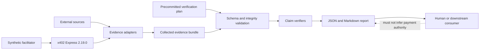

# Threat Model

## Scope

The protected system is a local evidence-analysis pipeline for agent-payment experiments. It ingests a precommitted verification plan and observed evidence, then emits a structured report containing narrowly scoped claim results.

The current lab does not custody funds, sign or submit a funded production payment transaction, release escrow, refund a buyer, or call production payment infrastructure. Its local x402 client does create an ephemeral EVM key and sign an EIP-3009 fixture authorization, which the recording double does not cryptographically or economically validate. Its highest-value assets are evidentiary integrity and semantic honesty—not money.

`trace.json` is outside the protected evidentiary derivation: it is an unsigned diagnostic export, not a committed artifact or an authenticated source of claim results.

## Security objectives

The design aims to preserve:

1. **Input integrity** — the evaluated plan and evidence can be identified exactly;
2. **Interaction correlation** — artifacts from different requests or jobs are not combined silently;
3. **Provenance clarity** — issuer, controller, capture path, and trust assumptions remain explicit;
4. **Reproducibility** — the same supported inputs and verifier version produce the same report;
5. **Semantic containment** — a result proves no more than its claim and declared trust model;
6. **Non-actuation** — reports cannot masquerade as native instructions to release or refund funds;
7. **Bounded local-fixture safety** — project-file access is confined, identifiers are checked, and network dereferencing is not implicit. Untrusted hosted ingestion and resource-exhaustion resistance are not security properties of this version.

## Assets

- verification plans and their precommitted predicates;
- evidence bundles and referenced artifacts;
- plan, schema, artifact, bundle, and report digests;
- interaction and job identifiers;
- source/controller declarations;
- generated JSON and Markdown reports;
- verifier code and pinned dependency versions;
- any credentials or sensitive payloads accidentally included in fixtures.

## Actors

- **Buyer:** requests or funds a service and may benefit from a negative outcome.
- **Provider:** performs the service and may benefit from a positive outcome.
- **Evidence source:** exposes an underlying payment, response, or job state that an adapter may represent as an artifact; the source and adapter may be controlled by either party, a third party, or the lab, and must not be conflated.
- **Lab operator:** selects inputs and runs the analysis.
- **Integrator:** maps a production system into the evidence model.
- **Payment rail/facilitator:** verifies or settles payments in a production deployment; synthetic in the current lab.
- **External attacker:** can supply malformed or replayed artifacts, tamper with files, or exploit parsers.

No actor is assumed honest merely because it has a distinct identifier or signing key.

## Trust boundaries

The main boundaries are:

- external source to adapter;
- adapter to evidence bundle;
- mutable filesystem to canonicalized/digested input;
- synthetic facilitator to production-like middleware;
- report to downstream interpretation.

## Threats, mitigations, and residual risk

Each entry distinguishes controls implemented by the current local fixture from controls that a hosted or production ingestion path would still need. Items in the latter category must not be inferred from the design alone.

### T1. Evidence modification

**Threat:** An artifact is altered after capture to change a claim result.

**Mitigations:** Canonical serialization, SHA-256 envelope digests, schema validation, and reports that bind the exact plan and bundle digests. Decisive fixture observations are Ed25519-signed over the canonical envelope, and authentication requires both the claim-selected issuer and its key binding inside the precommitted trust context.

**Residual risk:** A digest or valid fixture signature cannot show that the original observation was true, complete, independently acquired, or captured honestly. A compromised or dishonest harness signer can produce a cryptographically valid false attestation.

### T2. Replay of valid evidence

**Threat:** A valid receipt, response, or status from an earlier interaction is reused.

**Implemented now:** Interaction correlation, explicit artifact and issuer selection, payment/HTTP resource-to-plan binding, source-statement interaction-field binding, job-to-response-ID binding, capture times, optional artifact expiration, and duplicate artifact-ID rejection. The plan itself has no expiration field.

**Required before untrusted or production use:** Persisted nonce retention, a freshness/replay registry, issuer-specific uniqueness rules, and an externally committed time source where freshness matters.

**Residual risk:** The local process has no durable memory of previously accepted evidence. Replaying an internally consistent old dossier can therefore remain indistinguishable from first presentation unless an external commitment or registry supplies that context.

### T3. Cross-transaction substitution

**Threat:** A payment artifact from one transaction is paired with a successful response or job status from another.

**Mitigations:** Mandatory artifact interaction correlation; payment payload and signed HTTP-capture resource URLs must match the plan resource; signed source content must expose the plan-selected interaction field; deferred job IDs must match the authenticated HTTP capture; digest/signature checks and explicit issuer selection reject silent substitution.

**Residual risk:** The local harness injects and propagates its own resource, interaction, and job identifiers, so these checks demonstrate internally signed consistency rather than independent end-to-end propagation. Shared labels do not prove shared real-world identity if production systems are colluding or poorly integrated, and the settlement artifact has no independent resource/job commitment.

### T4. Selective omission

**Threat:** A party supplies only favorable artifacts and omits failures, reversals, or later state changes.

**Implemented now:** The plan identifies the artifacts required by individual claims; a missing selected artifact produces `UNKNOWN` rather than a favorable inference; the report preserves claim-specific reason codes and limitations.

**Required for completeness claims:** Read-only acquisition from an independently controlled, complete, append-only source, plus a defined observation window and proof that the queried range was exhaustive.

**Residual risk:** The lab cannot prove that no undisclosed artifact exists unless the source offers a complete, append-only, independently auditable view.

### T5. Self-attestation presented as neutral evidence

**Threat:** A provider-controlled service reports `completed` and is described as an independent verifier.

**Mitigations:** Separate issuer, controller, authentication, independence, and authority claims; precommitted issuer-to-key bindings; never infer independence from hostname, key, or signature; explicit limitations in results. The job-state signature and its authority premise are evaluated separately.

**Residual risk:** Ownership and effective control are institutional facts that may be hidden or change over time.

### T6. Self-selected signing key or valid signature over a false statement

**Threat:** An artifact embeds an attacker's public key and a matching signature, or a correctly bound source authentically signs inaccurate or fraudulent content.

**Mitigations:** The plan commits the exact trust context, including issuer-to-public-key bindings; each applicable claim names its expected issuer; signature verification rejects missing, substituted, or mismatched bindings. Source-statement matching also requires its plan-selected interaction field to equal the plan interaction. Claim semantics distinguish “matching statement observed,” “issuer authenticated,” and “X is true”; authority and independence require separate support.

**Residual risk:** Cryptography authenticates the speaker and bytes, not the underlying world.

### T7. Post-outcome plan or schema change

**Threat:** A party changes the success predicate after seeing the outcome.

**Mitigations:** Plan, schema, and trust-profile digests; immutable identifiers; precommitment requirement; and reports bound to exact inputs.

**Residual risk:** The local lab does not prove the real time at which a plan was committed. Production use needs an external timestamp, mutually witnessed commitment, or append-only registry.

### T8. Version or algorithm downgrade

**Threat:** An attacker selects an older schema, verifier, canonicalization rule, or digest algorithm with weaker behavior.

**Mitigations:** Explicit supported-version and algorithm allowlists, pinned dependencies, and fail-closed validation for unknown version labels. The evidence schema accepts declared x402 `2.19.0` exactly; it does not treat later or earlier labels as compatible.

**Residual risk:** The schema does not independently authenticate which implementation produced imported evidence. A consuming system can also choose an unsafe trust profile. Policy governance remains outside the cryptographic mechanism.

### T9. Receipt or HTTP-status overclaim

**Threat:** A valid settlement event, receipt, or HTTP `200` is presented as proof that the commercial obligation was fulfilled.

**Mitigations:** Atomic claims, typed reason codes, no global commercial `PASS`, and `economicAction: "NOT_EVALUATED"`. The public report schema enforces a closed claim-type/status/reason-code matrix and structurally rejects both `OBLIGATION_FULFILLED / PROVEN` and `ONCHAIN_SETTLEMENT / PROVEN`. Payment and settlement proof is restricted to signed `local-recording-double` artifacts that explicitly declare `realNetworkVerification: false` or `realFundsMoved: false`; on-chain settlement is always `UNKNOWN` in v0.1.

**Residual risk:** Humans or downstream software may ignore limitations. Clear naming and schema-level prohibitions reduce but cannot eliminate misuse.

### T10. Source outage, equivocation, or mutable state

**Threat:** An external system is unavailable, returns different answers over time, or shows different state to different observers.

**Implemented now:** Captured artifacts include timestamps and integrity commitments; absent required evidence does not become a positive result. The local fixture exposes uncertainty rather than claiming availability or consistency.

**Required for live sources:** A documented retry and timeout policy, freshness thresholds, multiple observers or independently comparable logs where equivocation matters, and rules for reconciling later state changes.

**Residual risk:** The current lab implements neither retries nor multi-observer acquisition. A snapshot may be valid at capture time yet cease to represent the later state relevant to payment.

### T11. Malicious artifact or parser abuse

**Threat:** Oversized JSON, deeply nested values, duplicate identifiers, path traversal, hostile references, or unexpected encodings cause denial of service or file disclosure.

**Implemented now:** After JSON parsing, public documents are checked against strict schemas; duplicate artifact identifiers are rejected; project-file reads are path-confined; remote references are not followed implicitly; normal execution is local and offline except for the loopback scenario server.

**Required before accepting untrusted input:** Byte limits enforced before parsing, nesting/depth and collection-size limits, bounded decompression if compressed input is allowed, parser hardening, fuzzing, and process-level CPU/memory/time isolation.

**Residual risk:** The current CLI can consume excessive resources while parsing a large or deeply nested document before schema validation runs. It is a local research fixture, not a hardened public ingestion service.

### T12. Secret or personal-data exposure

**Threat:** Payment headers, bearer tokens, private responses, or personal data are committed into an evidence bundle or public report.

**Implemented now:** Bundled scenarios use synthetic fixtures and ephemeral keys, persist no funded key, and document that committed reports must contain no credentials or production personal data. Publication still depends on human review.

**Required for production evidence:** Explicit field allowlists, automatic secret and personal-data redaction before persistence, minimization rules, retention/deletion policy, and a review gate before export or publication.

**Residual risk:** Automatic redaction is not implemented. A user who imports real payloads can disclose sensitive values in a bundle, digest-linked report, terminal output, or committed fixture.

### T13. Synthetic facilitator confused with production proof

**Threat:** A local `settled` event is cited as evidence of an actual transfer or production reliability.

**Implemented now:** Fixture-specific signed provenance, explicit trust-profile limitations, a required `local-recording-double` mode, `realNetworkVerification: false`/`realFundsMoved: false`, and example-report language distinguish a recorded local boundary call from asset movement. The scenarios may use syntactically valid network identifiers, but no RPC endpoint, chain, funded account, or production facilitator is contacted. An alleged chain-confirmation artifact still yields `UNKNOWN` because no chain verifier exists.

**Residual risk:** Screenshots or excerpts can lose context. Generated outputs should carry the limitation structurally, not only in surrounding prose.

### T14. Report used as a payment instruction

**Threat:** An integrator treats a report as authorization to release, refund, reject, or retain funds.

**Mitigations:** The report schema permits only `economicAction: "NOT_EVALUATED"`; the core exposes no fund-moving methods or fields; CLI exit codes represent technical execution, not economic verdicts.

**Residual risk:** A third party can always write separate code that reacts to a report. That policy and liability belong to that separate system and must not be attributed to the lab.

### T15. Harness attestation confused with provider or channel provenance

**Threat:** A consumer treats the signature on an HTTP or job artifact as proof that the provider, a remote origin, or an authenticated TLS channel emitted the underlying content.

**Implemented now:** HTTP artifacts identify `lab-http-capture-adapter`; job artifacts identify `lab-job-state-adapter`; the applicable plan claims select those issuers explicitly; their keys are bound inside the precommitted trust context; and report limitations keep origin, independence, and authority separate. HTTP captures must match the plan resource, while job artifacts must match the job ID in the signed HTTP capture.

**Residual risk:** These signatures authenticate only what the local harness identities attested. They do not prove provider authorship, DNS/TLS origin, an external capture path, or honest acquisition. A production provenance claim needs a provider signature, authenticated API/TLS transcript, notary/attestation mechanism, or other explicitly modeled acquisition proof.

## Threats not modeled by the local fixture

The first version does not test:

- private-key custody, wallet compromise, or transaction signing attacks;
- facilitator compromise or insolvency;
- blockchain consensus, reorganization, MEV, gas, or finality;
- production TLS interception, DNS compromise, or API-account takeover;
- collusion among buyer, provider, source, and operator;
- legal enforceability of a verification plan;
- regulatory classification, insurance, or liability allocation;
- confidentiality of production holdouts or benchmarks;
- economic attacks against a real escrow or evaluator.

These require different environments and, in several cases, legal or organizational controls rather than more local code.

## Security invariants

Changes should preserve the following invariants:

- evidence absence yields `UNKNOWN` unless the claim explicitly concerns absence and the collection mechanism can prove completeness;
- signature validity never implies source independence;
- settlement never implies body binding or fulfilment without separate evidence;
- payment and HTTP artifacts must bind their resource URL to the plan resource before supporting their semantic claims;
- a source statement must bind its plan-selected interaction field to the plan interaction;
- a fixture adapter signature never implies provider, remote-origin, independence, or authority properties not separately committed and verified;
- `ONCHAIN_SETTLEMENT` remains `UNKNOWN` until a chain-specific verifier is implemented;
- artifacts from inconsistent interactions are rejected or isolated;
- plan and bundle digests in the report correspond to the evaluated canonical JSON values;
- unknown versions and algorithms do not silently downgrade;
- reports contain `economicAction: "NOT_EVALUATED"` and no release/refund instruction;
- the synthetic facilitator is never labeled as production settlement evidence.

## Review triggers

Revisit this threat model when adding:

- a live facilitator, wallet, testnet, or mainnet;
- whole-bundle signing or a key registry;
- a zkTLS/TLS-notary adapter;
- external source credentials;
- confidential benchmarks or holdout data;
- persistent storage or a hosted API;
- a downstream consumer that reacts economically to a report;
- a provider-authenticated response, remote TLS/API provenance mechanism, or production job-state source.

Each of those changes introduces a new trust or custody boundary.
