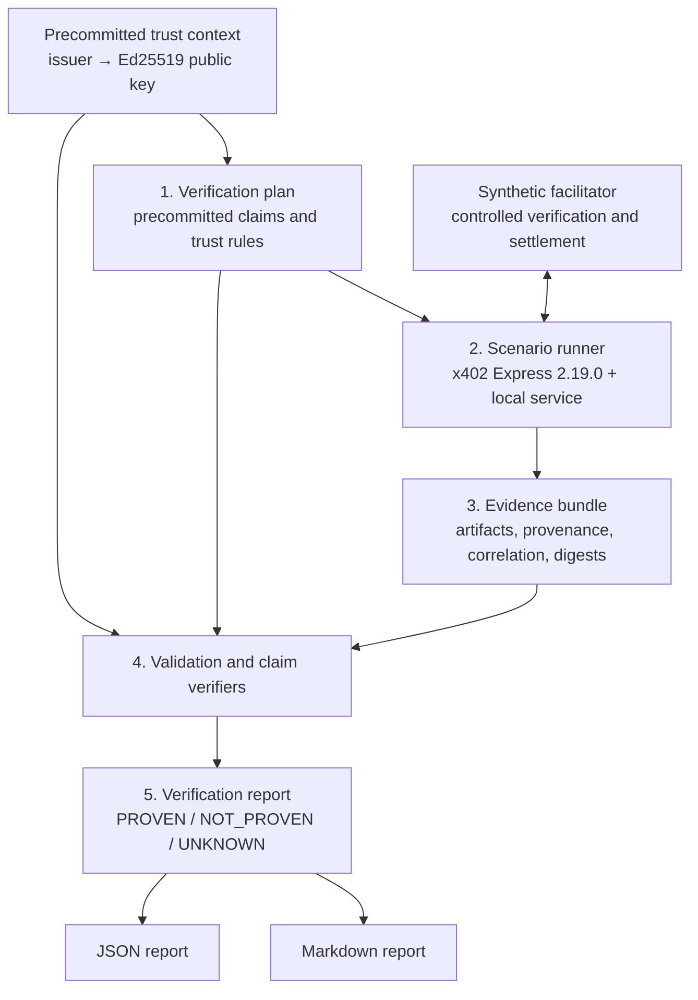
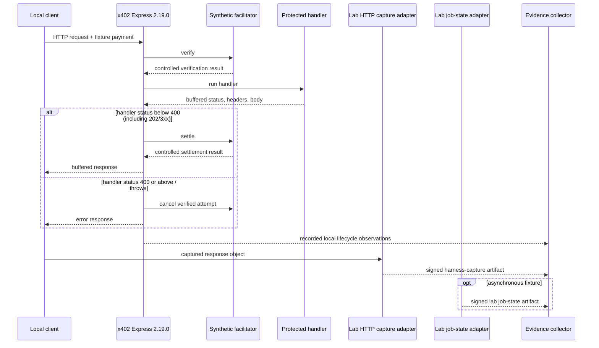

# Architecture

## Purpose

Agent Payment Evidence Lab is an executable boundary map for paid agent interactions. It shows which propositions follow from payment, HTTP, output, and later-state artifacts—and which propositions remain unsupported.

The architecture is intentionally not an escrow, payment facilitator, dispute service, or universal clearing oracle. It produces evidence analysis only.

## Core invariant

The system never converts technical observations into an economic instruction.

Every report contains:

```json
{
  "economicAction": "NOT_EVALUATED"
}
```

There are no core operations named `release`, `refund`, `pay`, `rejectJob`, or semantic equivalents.

## Data flow



The separation between the plan, evidence bundle, and report is the main architectural decision.

## The three fundamental artifacts

### 1. Verification plan

The plan defines the question before the answer is known. It contains:

- a versioned specification identifier;
- a stable plan and interaction identity;
- the subject/resource being evaluated;
- atomic claims, selected artifact identifiers, and expected issuer identifiers;
- schema digests where relevant;
- the declared trust-profile identifier and its exact digest, including issuer-to-key bindings.

The plan is not evidence. It records the predicates the experiment intends to evaluate.

### 2. Evidence bundle

The bundle records observations without deciding their commercial meaning. Each artifact should include:

- a stable artifact identifier and kind;
- capture time;
- issuer, role, and declared controller;
- content or a content reference;
- a digest over the evaluated representation;
- correlation data such as interaction or job ID;
- limitations and trust assumptions where necessary.

The decisive fixture observations—payment verification, settlement/cancellation, HTTP capture, job state, and source statements—are Ed25519-signed over their canonical artifact envelope. The envelope includes the artifact identity, kind, time, issuer declaration, content, and interaction correlation. A verifier authenticates such an artifact only when the claim selects the expected issuer and the plan-committed trust context binds that issuer to the signing key. The output schema is instead precommitted by its content digest in the plan.

The bundle is not a verdict. A provider statement and an independent-system statement can contain identical bytes while having materially different trust implications.

### 3. Verification report

The report is a deterministic derivation from an exact plan and evidence bundle. It contains:

- report and engine versions;
- digests of the exact inputs;
- one result per claim;
- evidence references, reason codes, and limitations;
- counts of `PROVEN`, `NOT_PROVEN`, and `UNKNOWN`;
- the fixed non-action value `economicAction: "NOT_EVALUATED"`.

The report does not collapse results into a commercial grade.

`trace.json` sits outside this three-document derivation. It is an unsigned diagnostic export, is not committed by the plan, bundle, or report, and is neither authenticated nor reconstructed when a dossier is verified. The dossier verifier requires the file to exist and parse as JSON only as a shape check; trace content is not a claim input.

## x402 execution boundary

The initial runner uses the official `@x402/express` middleware pinned at `2.19.0`. This gives the scenarios a real implementation boundary for request verification, handler execution, response buffering, settlement dispatch, and verified-payment cancellation. The public schema accepts exactly this declared version and rejects any other protocol-version label rather than reusing these semantics optimistically; it does not independently authenticate the implementation that produced imported evidence.

The facilitator behind that boundary is synthetic. It returns controlled outcomes and records lifecycle events without contacting a payment network or moving funds.



This arrangement is intentionally asymmetric:

- it exercises production middleware control flow;
- it simulates payment verification and settlement semantics;
- it makes no claim about production payment validity or finality.

The client creates a local EVM key and signs an EIP-3009 fixture authorization, but the recording double does not cryptographically/economically validate it and no funded transaction is submitted. The artifact builder separately adds Ed25519 signatures using precommitted fixture identities after collecting local observations; those are not signatures emitted by upstream x402. They do not change the boundary's limits. `local-recording-facilitator` signs only artifacts whose content declares `mode: "local-recording-double"` and explicitly says that network verification or real fund movement did not occur. Payment verification also binds the payment payload's resource URL to the plan resource.

`lab-http-capture-adapter` signs the response object observed by the local client/harness and binds its `resourceUrl` to the plan resource. This is a harness attestation, not a provider signature or authenticated remote-origin/TLS transcript. `lab-job-state-adapter` signs the local fixture job state; whether that source is authoritative is a separate precommitted trust-profile decision, and its job ID must match the ID in the signed HTTP capture.

The harness itself creates and propagates these resource, interaction, and job-ID values. Their checks establish internal signed consistency, not independent end-to-end correlation across autonomous production systems. The v0.1 `authoritativeSources` field is likewise a global issuer allowlist, not a grant scoped by claim, predicate, resource, or time.

## Layered interpretation

The architecture treats a paid agent workflow as several non-equivalent layers:

| Layer | Example artifact | Narrow proposition it may support | What it does not imply |
| --- | --- | --- | --- |
| Payment presentation | payment header/payload | a payment credential was presented | it was valid or settled |
| Payment verification | signed recording-double artifact | the named fixture key attested that its local verifier accepted the payload for the plan resource | production verification or assets moved |
| Settlement | signed recording-double artifact | the named fixture key attested that its local boundary returned success with `realFundsMoved: false` | transfer, finality, or correct delivery |
| HTTP transport | signed harness capture | `lab-http-capture-adapter` attested to the local response object for the plan resource | provider authorship, remote channel/origin authentication, or later completion |
| Structural output | schema result | the observed body matches a schema | semantic correctness or utility |
| Deferred state | signed fixture job status | `lab-job-state-adapter` attested to a state whose job ID matches the response | independence; authority is a separate trust-profile input |
| Commercial obligation | contract/mandate | what the parties intended | that the intention was fulfilled |

Claim verifiers must not jump between layers without explicit binding evidence.

## Scenario architecture

The first scenario set explores six distinct seams:

1. **Valid synchronous response** — payment lifecycle and structurally valid output are observed, while general fulfilment remains outside the evidence.
2. **Handler error** — demonstrates the pinned Express middleware's no-settlement behavior for status `>= 400`.
3. **Settled, invalid schema** — separates payment success from output conformance.
4. **Accepted, then asynchronous failure** — separates synchronous success from deferred outcome.
5. **Provider self-attestation** — authenticates the provider fixture key and matches the signed statement's declared interaction; independence and fulfilment remain unresolved.
6. **Separate source statement** — authenticates a distinct precommitted fixture identity while keeping independence and contractual authority unresolved.

Each scenario produces the same plan/bundle/report document shape while adding only the artifacts needed for its seam (for example, schema, job-state, or source-statement evidence). New protocols should not require a new semantic model.

## Internal modules

The project is a single TypeScript package with modular boundaries:

- `domain/` owns claim, evidence, plan, and report types;
- `ports/` defines interfaces for evidence collection, claim verification, and reporting;
- `adapters/` translates protocol-specific observations into evidence artifacts;
- `verifiers/` evaluates atomic claims;
- `reporters/` renders the same report as JSON or Markdown;
- `scenarios/` contains reproducible fixtures;
- `schemas/` defines the public artifact contracts;
- `tests/` contains 50 checks covering unit behavior, integrations, adversarial bindings, CLI behavior, and stable golden outputs.

The dependency direction is toward the domain model. A protocol adapter may know x402; the domain model must not require x402.

## Validation pipeline

Before evaluating a claim, `analyzeEvidence`:

1. validate the plan and bundle against their versioned schemas;
2. reject duplicate artifact identifiers;
3. verify supported versions and algorithms;
4. canonicalize and hash relevant inputs;
5. verify artifact digests;
6. enforce interaction correlation and claim-specific artifact selection;
7. verify the claim's explicit expected issuer, the committed issuer-to-key binding, and the artifact signature where required;
8. enforce resource bindings for payment and HTTP captures, source-statement interaction-field binding, and response-to-job-ID binding;
9. apply artifact expiration and trust-profile rules (the local lab has no plan-expiration or persistent replay/freshness registry);
10. dispatch each claim to an explicit verifier;
11. preserve the reason codes, evidence references, and any limitations emitted by the selected verifier.

`analyzeEvidence` validates the plan and bundle but does not itself validate the report it has just produced. Dossier verification is the separate outer check: it validates the stored public report against its schema, recomputes `plan + bundle -> report` using the stored evaluation context, and compares the Markdown projection.

The report schema enforces a closed `claim type ↔ status ↔ reasonCode` matrix. It rejects combinations that the verifier semantics do not permit, notably `OBLIGATION_FULFILLED / PROVEN` and `ONCHAIN_SETTLEMENT / PROVEN` in v0.1.

A technical validation error is not an economic `FAIL`. The CLI may return a non-zero exit code because it could not process the inputs; the report's claim semantics remain separate.

## Determinism and reproducibility

Reports bind their exact plan and bundle through canonical digests. Golden tests make semantic or serialization drift visible.

Determinism is scoped to the same:

- canonical input representation;
- verifier and schema versions;
- trust profile;
- algorithm allowlist;
- controlled scenario clock and fixture state.

External sources introduce time and availability. Adapters must capture enough raw evidence to explain a result rather than relying only on the latest mutable state.

The v0.1 on-chain claim is intentionally non-operative: `ONCHAIN_SETTLEMENT` always remains `UNKNOWN`, including when a JSON artifact claims confirmation, because no chain-specific receipt/finality verifier is implemented.

## Why this is not a clearing oracle

A clearing oracle would normally be expected to produce or trigger an authoritative economic decision. This lab does neither.

Within its precommitted fixture identities and trust profile, it can demonstrate that:

- a signed recording-double artifact says its local payment boundary accepted or settled a payload for the plan resource;
- an output passed a deterministic schema;
- a prebound source key signed a statement tied to the plan interaction;
- the available evidence does not bind those facts together.

It cannot infer:

- that the parties appointed the source as their expert determiner;
- that the source is neutral;
- that a loss should be allocated to buyer or provider;
- that funds should move.

That boundary makes the artifact useful before the commercial and legal hypotheses are validated.

## Extension seams

The architecture is designed to grow by adding adapters and verifiers:

- other x402 framework or facilitator observations;
- read-only on-chain job/evaluator state;
- a signed whole-bundle envelope (individual decisive fixture artifacts are already signed);
- zkTLS or TLS-notary provenance proofs;
- authority/trust profiles;
- a static report explorer;
- optional testnet capture.

Extensions must preserve the plan/evidence/report separation and the non-actuation invariant. See [Extension model](./extension-model.md).
